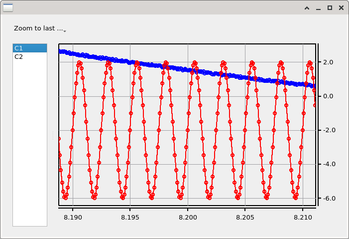

Live timeseries analysis on your desktop!

# About

Lognplot is a graphical viewer for time series data. Unlike many other
projects in this area, lognplot is not a client server architecture.
It is a single application which simply views your streaming data.
A primary usecase would be to visualize live data, coming from an
arduino or a robotic system.

Features:
- Zoom levels
- Fast query of data
- python GUI implementation (based on pyqt5)
- rust GUI implementation (based on gtk-rs / cairo)
- Send data over TCP/IP link to GUI.

# Screenshots

This is an example of the plot window, when zoomed out.
Note that not all points are displayed, but aggregates
of the data are visualized as min/max/mean lines.

When zooming into the data, the individual data points come
into picture.

# Usage

To use the python side of this code, start as a demo the softscope:

    $ cd python
    $ python softscope.py

This will popup a plot window. Zooming and panning can be done with the keyboard
keys w,a,s,d and i,j,k,l. Press space or enter to autofit. The data is
a 10 kHz generated signal.

Another demo is the softscope server. This will open a TCP/IP port
which can receive data.

    $ cd python
    $ python -m lognplot

The softscope is now
ready to receive streaming data via network.

Next, start the demo datasource, which will send data via TCP to this GUI:

    $ cd demo
    $ python noize_source.py

Another server demo is the rust side of the code. Start the GUI like this:

    $ cargo run

This application will be able to receive data via TCP/IP.

# Documentation

Documentation for python users can be found here: https://lognplot.readthedocs.io/en/latest/

# Plan

This is a list of things to do:

- Float only
- Demo log program
- PyQt5 implementation
- gtk-rs implementation

# Similar projects

There is an interesting list of similar projects. Do you know of another
project? Please submit a pull request or an issue!

- getcurve.io (https://getcurve.io/)
- grafana (https://grafana.com/)
- KST plot (https://kst-plot.kde.org/)
- plot juggler https://github.com/facontidavide/PlotJuggler
- tracy profiler (https://bitbucket.org/wolfpld/tracy)
- trace compass: https://www.eclipse.org/tracecompass/
- speedscope: https://www.speedscope.app/

# Project structure

The project is divided into several crates.

- A time series database ala sqlite to store time series and query them.
- A cairo based drawing

# Idea list

- use vulkano-rs instead of openGL
- use cassowary to layout parts of the GUI
- render pretty lines using shaders

