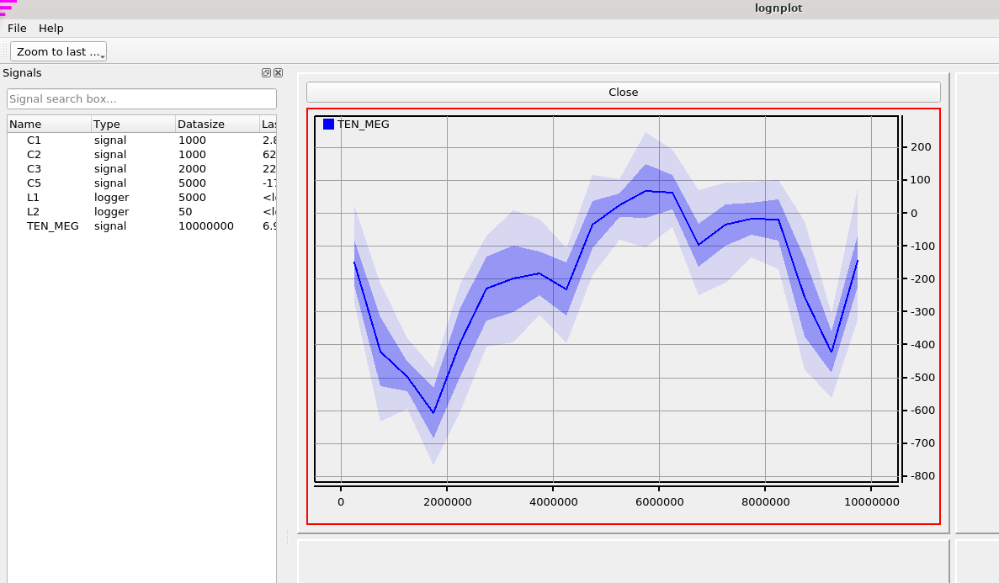
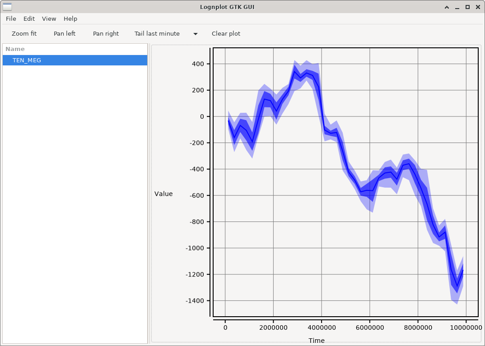

Live timeseries analysis on your desktop!

# About

Lognplot is a graphical viewer for time series data. Unlike many other
projects in this area, lognplot is not a hosted web application.
It is a desktop application which visualizes your streaming data.
A primary usecase would be to visualize live data, coming from an
embedded or a robotic system.

Features:
- Zoom levels
- Fast query of data
- python GUI implementation (based on PyQt5)
- rust GUI implementation (based on gtk-rs / cairo)
- Send data over TCP/IP link to GUI.

# Screenshots

This is an example screenshot of the lognplot python application, visualizing
10 million datapoints. Note that zooming is still smoothly performed.

This is an example screenshot of the GTK gui implemented with rust, visualizing also 10 million
datapoints.

This is an example of the plot window, when zoomed out.
Note that not all points are displayed, but aggregates
of the data are visualized as min/max/mean/stddev lines.

When zooming into the data, the individual data points come
into picture.

# Installation

Note that at this moment, you will want to grab the latest
git version from github.

First clone this repository:
    $ git clone https://github.com/windelbouwman/lognplot.git

For python, follow this steps:

    $ cd lognplot/python
    $ pip install --editable .
    $ python -m lognplot

For rust, follow these steps:

    $ cd lognplotgtk
    $ cargo run --release

Packages are release for rust and python

Rust crate: https://crates.io/crates/lognplot

Python package: https://pypi.org/project/lognplot/

# Usage

To use the python side of this code, start as a demo the softscope:

    $ cd python
    $ python softscope.py

This will popup a plot window. Zooming and panning can be done with the keyboard
keys w,a,s,d and i,j,k,l. Press space or enter to autofit. The data is
a 10 kHz generated signal.

Another demo is the softscope server. This will open a TCP/IP port
which can receive data.

    $ cd python
    $ python -m lognplot

The softscope is now
ready to receive streaming data via network.

Next, start the demo datasource, which will send data via TCP to this GUI:

    $ cd demo
    $ python noize_source.py

Another server demo is the rust side of the code. Start the GUI like this:

    $ cd lognplotgtk
    $ cargo run

This application will be able to receive data via TCP/IP.

# Documentation

Documentation for python users can be found here: https://lognplot.readthedocs.io/en/latest/
Documentation for rust users can be found here: https://docs.rs/lognplot

# Plan

This is a list of things to do:

- PyQt5 implementation
- gtk-rs implementation

# Requirements for live data visualization

- Append data structure to enable appending new data
- Data point aggregation for zooming out and showing min/max/mean lines

# Similar projects

There is an interesting list of similar projects. Do you know of another
project? Please submit a pull request or an issue!

- getcurve.io (https://getcurve.io/)
- grafana (https://grafana.com/)
- KST plot (https://kst-plot.kde.org/)
- plot juggler https://github.com/facontidavide/PlotJuggler
- tracy profiler (https://bitbucket.org/wolfpld/tracy)
- trace compass: https://www.eclipse.org/tracecompass/
- speedscope: https://www.speedscope.app/

# Project structure

The project is divided into several crates.

- A time series database ala sqlite to store time series and query them.
- A cairo based drawing

# Idea list

- use vulkano-rs instead of openGL
- use cassowary to layout parts of the GUI
- render pretty lines using shaders

